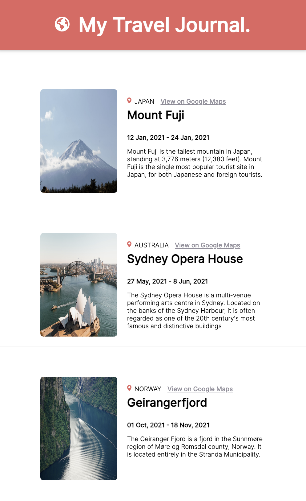

# Travel Journal Made with React

Welcome to the Travel Journal project! Developed using the `React` framework along with the efficient `Vite` build tool, this application showcases information about my travels.

## Live Site

- [Apple Calculator Dupe](https://apple-calculator-dupe.onrender.com/)

## Table of contents

- [Overview](#overview)
- [The challenge](#the-challenge)
- [Screenshot](#screenshot)
- [My process](#my-process)
- [Built with](#built-with)
- [What I learned](#what-i-learned)
- [Continued development](#continued-development)
- [Author](#author)

## Overview

Testing my React skills by creating a Travel Journal.

### The challenge

- Dynamically render multiple cards

### Screenshot

## My process

I recognized the need to dynamically render multiple cards. To achieve this, I organized all the necessary information into an array of objects. With the data in place, I structured the HTML within my React component and styled a singular card design. Subsequently, I developed a function to utilize the map method, allowing me to iterate over the array of objects and render a distinct card component onto the DOM for each object present.

### Built with

- React
- Semantic HTML5 markup
- FlexBox
- Mobile-first workflow
- JavaScript

### What I learned

I've acquired the skill to effectively render multiple cards by iterating through an array of data and dynamically generating the card components. This process allows me to display various sets of information in a structured and organized manner.

### Continued development

In the future, I aim to delve deeper into `React hooks` and experiment with incorporating `Sass` within a project.

## Author

- Twitter - [@kiarahoheb](https://www.twitter.com/kiarahoheb)
- LinkedIn - [@kiarahoheb](https://www.linkedin.com/in/kiara-hoheb-641157244/)